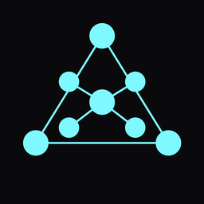
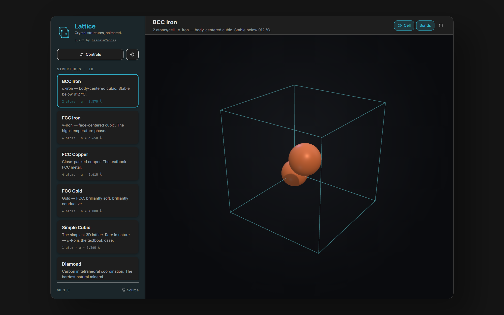
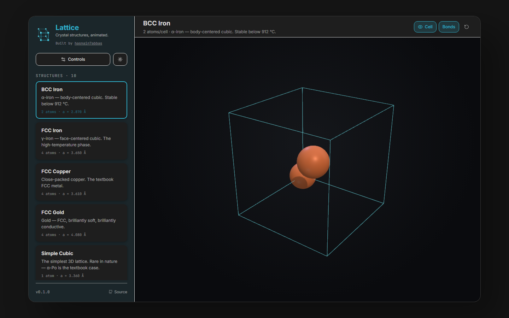
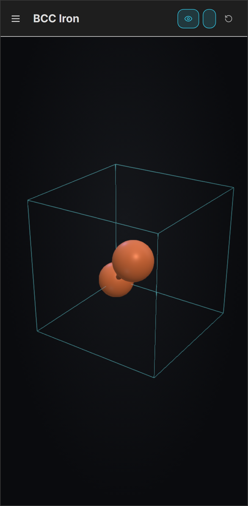

<div align="center">

<a href="https://hasnain7abbas.github.io/lattice/">
  
</a>

<h1 align="center">Lattice</h1>

<p align="center">
  <b>✨ Crystal structures, animated.</b><br/>
  An animation-first solid-state physics explorer — desktop, mobile and web.
</p>

[![Web Demo][Web-image]][demo-url]
[![Windows][Windows-image]][download-url]
[![Android][Android-image]][download-url]
[![Release][Release-image]][release-url]
[![License][License-image]](#-license)

[![Tauri][Tauri-image]][tauri-url]
[![React][React-image]][react-url]
[![Three.js][Three-image]][three-url]
[![TypeScript][TS-image]][ts-url]
[![Vite][Vite-image]][vite-url]
[![Tailwind][Tailwind-image]][tailwind-url]

[**🌐 Try the Web Demo**][demo-url] · [**📥 Download**][download-url] · [**📖 Docs**](#-get-started) · [**🗺 Roadmap**](#-roadmap) · [**⭐ Star**][star-url]

[demo-url]: https://hasnain7abbas.github.io/lattice/
[download-url]: https://github.com/hasnain7abbas/lattice/releases/latest
[release-url]: https://github.com/hasnain7abbas/lattice/releases
[star-url]: https://github.com/hasnain7abbas/lattice/stargazers
[tauri-url]: https://tauri.app
[react-url]: https://react.dev
[three-url]: https://threejs.org
[ts-url]: https://www.typescriptlang.org
[vite-url]: https://vitejs.dev
[tailwind-url]: https://tailwindcss.com

[Web-image]: https://img.shields.io/badge/🌐_Web_Demo-Live-22c55e?style=for-the-badge
[Windows-image]: https://img.shields.io/badge/Windows-Installer-0078D4?style=for-the-badge&logo=windows&logoColor=white
[Android-image]: https://img.shields.io/badge/Android-APK-3DDC84?style=for-the-badge&logo=android&logoColor=white
[Release-image]: https://img.shields.io/github/v/release/hasnain7abbas/lattice?style=for-the-badge&color=8b5cf6
[License-image]: https://img.shields.io/badge/License-MIT-eab308?style=for-the-badge

[Tauri-image]: https://img.shields.io/badge/Tauri-2.x-FFC131?logo=tauri&logoColor=black
[React-image]: https://img.shields.io/badge/React-18-61DAFB?logo=react&logoColor=black
[Three-image]: https://img.shields.io/badge/Three.js-r169-000000?logo=three.js&logoColor=white
[TS-image]: https://img.shields.io/badge/TypeScript-5-3178C6?logo=typescript&logoColor=white
[Vite-image]: https://img.shields.io/badge/Vite-5-646CFF?logo=vite&logoColor=white
[Tailwind-image]: https://img.shields.io/badge/Tailwind-3-06B6D4?logo=tailwindcss&logoColor=white

---




</div>

## 🪞 Why Lattice

Most solid-state physics tools throw a static diagram at you and expect you to mentally rotate a cube of dots. **Lattice doesn't.** Every structure renders as a live 3D scene, and the morph scrubber lets you literally drag through the transition from BCC to FCC to diamond to NaCl — watching atoms slide into place. Built native with Tauri 2, so the desktop installer is **~3 MB**, not a 200 MB Electron blob.

## 🚀 Try It Right Now

<table>
<tr>
<td align="center" width="33%">

### 🌐 Web
**No install. Just open.**

[][demo-url]

Runs in any modern browser.

</td>
<td align="center" width="33%">

### 🖥 Desktop
**Native Windows app.**

[][download-url]

~2.3 MB installer. No Electron.

</td>
<td align="center" width="33%">

### 📱 Mobile
**Android APK.**

[][download-url]

arm64, side-loadable.

</td>
</tr>
</table>

## 📥 Downloads

All builds live on the [Releases page][download-url]. Latest is **v0.2.1**.

| Platform | File | Size | Notes |
| :--- | :--- | :---: | :--- |
| 🪟 Windows (installer) | `Lattice_0.2.1_x64-setup.exe` | 2.3 MB | NSIS — **recommended** |
| 🪟 Windows (MSI) | `Lattice_0.2.1_x64_en-US.msi` | 3.3 MB | For managed deployments |
| 🪟 Windows (portable) | `Lattice.exe` | 9.3 MB | No installer, just run |
| 🤖 Android (arm64) | `Lattice_0.2.1_arm64-release.apk` | 12 MB | Release build — enable "Install unknown apps" to side-load |
| 🍎 macOS / 🐧 Linux | _coming soon_ | — | Build locally with `npm run tauri build` |

## ✨ Features

- 🎞 **Animated lattice viewer** — every structure is a live 3D scene, not a static diagram
- 🌀 **Morph scrubber** — drag between two structures, watch atoms rearrange in real time
- 🔳 **All lattice sites toggle** — render an atom at every equivalent site of the unit cell (all 8 corners, 6 face centers, etc.), so an FCC/BCC cube looks visually complete
- 📱 **Mobile-tuned UI** — compact header on small screens, larger touch targets, safe-area-aware drawer + scrubber, dynamic viewport height (`dvh`) so the Android URL bar doesn't clip the canvas
- 🧪 **10 built-in presets** — metals, covalent, ionic, compound solids
- 📐 **Miller plane overlay** — visualise `(hkl)` planes against the unit cell
- 🎨 **Element-aware colouring** from a built-in periodic-table dataset
- 🌑 **NextChat-inspired dark UI** — responsive sidebar collapses to a mobile drawer
- 📦 **Native, tiny** — Tauri 2, ~3 MB Windows installer, native Android APK
- 🔌 **Offline-first** — zero network calls, zero telemetry, zero accounts
- 🌐 **Runs anywhere** — same React+Three.js codebase ships to Web, Windows and Android

## 🔬 Included Crystals

<table>
<tr><th>Family</th><th>Structures</th></tr>
<tr><td>🟦 BCC metals</td><td>Iron (α-Fe)</td></tr>
<tr><td>🟩 FCC metals</td><td>Iron (γ-Fe), Copper, Gold</td></tr>
<tr><td>⬜ Simple cubic</td><td>Reference cell</td></tr>
<tr><td>💎 Covalent</td><td>Diamond</td></tr>
<tr><td>🧂 Ionic</td><td>Rock Salt (NaCl), Cesium Chloride (CsCl)</td></tr>
<tr><td>⚗️ Compound</td><td>Zincblende (ZnS), Fluorite (CaF₂)</td></tr>
</table>

More land with every release. Open an [issue](https://github.com/hasnain7abbas/lattice/issues) if there's a structure you want next.

## 📸 Screenshots

<div align="center">

| Desktop | Mobile |
| :---: | :---: |
|  |  |
| _The morph scrubber transitioning BCC → FCC_ | _Sidebar collapsed into a drawer_ |


</div>

## 🚀 Get Started

1. **Try the [web demo][demo-url]** to see if you like it — no install needed
2. **Download** the installer for your platform from the [Releases page][download-url]
3. **Launch Lattice** — the sidebar lists every preset; click one to render
4. **Drag the morph scrubber** at the bottom to transition between two structures

No accounts. No API keys. No sign-in. It just runs.

## 🛠 Build From Source

```bash
git clone https://github.com/hasnain7abbas/lattice.git
cd lattice
npm install

npm run tauri dev       # desktop, hot reload
npm run tauri build     # desktop installers → src-tauri/target/release/bundle
npm run dev             # browser-only dev server (no Tauri)
npm run build           # static web bundle → dist/
```

**Requirements:** [Node 20+](https://nodejs.org) · [Rust stable](https://rustup.rs) · MSVC build tools (Win) or Android SDK+NDK (mobile)

<details>
<summary><b>📱 Android build instructions</b></summary>

```bash
npm run android:prepare
npm run android:init        # first time only
npm run android:dev         # connect a device or start an emulator
npm run android:apk         # → src-tauri/gen/android/app/build/outputs/apk
```

**Windows note:** Tauri's APK build pipeline tries to create a symlink from the cross-compiled `.so` into the Gradle `jniLibs` folder. Windows refuses this without Developer Mode. To work around that without elevating, this repo ships `scripts/android-rust-shim.mjs` (wired in via the `tauri` npm script) — it runs Tauri's `android-studio-script` for the real cargo step, then copies the resulting `.so` into `jniLibs` with a plain file copy. Standard usage (`npm run tauri build`, `npm run tauri dev`, etc.) is unaffected; the shim only intervenes on the Android Studio script path.

For release signing: see `scripts/setup-android-signing.mjs` and run `npm run android:signing`.

</details>

<details>
<summary><b>🩺 Doctor — verify your toolchain</b></summary>

```bash
npm run doctor
```

Checks Node/Rust/Tauri/Android versions and prints what's missing.

</details>

## 🏗 Architecture

```
src/
├── app/        # top-level app shell
├── scene/      # Three.js / R3F viewport, effects, primitives
├── ui/         # sidebar, drawer, scrubber, window chrome
├── data/       # crystal presets + periodic-table data
├── stores/     # Zustand state
└── styles/     # Tailwind + globals
src-tauri/      # Rust backend, Tauri config, native bundles
.github/
└── workflows/  # GitHub Pages deploy
```

| Layer | Stack |
| :--- | :--- |
| 🐚 Shell | Tauri 2 (Rust + WebView2 / Android WebView) |
| ⚛️ Frontend | React 18 + TypeScript + Vite |
| 🎲 3D | Three.js r169 · @react-three/fiber · drei · postprocessing |
| 🗃 State | Zustand |
| 💫 Motion | Framer Motion · @react-spring/three |
| 🎨 Style | Tailwind CSS |
| 🔣 Icons | lucide-react |

## 🗺 Roadmap

- [x] BCC, FCC, simple cubic, diamond
- [x] Ionic structures (NaCl, CsCl)
- [x] Compound structures (ZnS, CaF₂)
- [x] Morph scrubber between presets
- [x] Mobile-responsive UI
- [x] Windows installers (NSIS + MSI + portable)
- [x] Android APK
- [x] Web demo on GitHub Pages
- [ ] Miller plane editor (custom `hkl` input)
- [ ] HCP family (Mg, Zn, Ti)
- [ ] Perovskite (CaTiO₃) and spinel structures
- [ ] iOS build via `tauri ios`
- [ ] macOS + Linux installers via CI
- [ ] Signed release-mode APK on the Play Store
- [ ] User-defined unit cells (paste a CIF)

## 📰 What's New

- 🚀 **v0.2.1** — visual polish + mobile scrubber fix. Atoms now ship with glossy clearcoat highlights and a soft additive rim halo (no more flat-coloured balls), bonds are ~40% thinner so the lattice geometry reads cleanly, and the morph scrubber no longer slides off-screen on phones (Framer Motion's transform was clobbering the centering translate).
- 🚀 **v0.2.0** — mobile UI overhaul. New "All lattice sites" toggle (renders every equivalent corner/face atom of a unit cell), compact toolbar on phones, safe-area-aware drawer + scrubber, dynamic viewport height so the Android URL bar can't clip the 3D canvas. Release-signed Android APK + refreshed Windows installers.
- 🌐 **Web demo** — same app, now runs in the browser via GitHub Pages
- 🚀 **v0.1.0** — first public release. Windows installers, Android APK, 10 crystal presets, mobile-responsive NextChat-style UI, simple-cubic logo

## 🤝 Contributing

Issues and PRs welcome. Adding a new crystal? Drop it into `src/data/presets.ts` — the sidebar picks it up automatically.

## ⭐ Show Some Love

If Lattice helped you visualise something you couldn't before, a ⭐ on the [repo][star-url] is the best thank-you.

[](https://star-history.com/#hasnain7abbas/lattice&Date)

## 📄 License

[MIT](LICENSE) — do whatever you want, just don't blame me. Bundled fonts, icons and datasets retain their original licenses.

---

<div align="center">

Made with 🦀 Rust, ⚛️ React and 🎲 Three.js.<br/>
Powered by [Tauri](https://tauri.app).

<sub>If you build something cool with this, [tell me](https://github.com/hasnain7abbas/lattice/issues/new) — I love seeing it.</sub>

</div>
